# Project 2: Commerce | edX | Harvard | CS50 - Web Programming with Python and JavaScript
##### Creating a web application that is acts like a online E-Commerce Auction website where users can publish listings, add listings to their watchlist, bid on a listing and even comment on them.
---
   

## Models
---
The web application uses 5 models as follows:  
1. **User:** This is a predefined Django model who's username, email-id and password field we will be using in this web application.  

2. **Listing**: This model will store information regarding a listing. The fields are title, description, base price, current price, image(to save image URL of listing), category(type of listing), owner(Foreign Key to User), active(status of the listing), date.  

3. **Bid:** This model is used to registers bids made by users. It contains information such as bidder(who is bidding - Foreign Key to User), bid(bid amount) and item(on which bid is being made - Foreign Key to Listing)  

4. **Comment:** This model stores all the comments made by various users on the listings. It stores listing(on which comment is made - Foreign Key to Listing), commentor(who made the comment - Foreign Key to User), comment, date(of comment).  

5. **Watchlist:** This models helps in keep tracking of the watchlist listings for users. It does so by storing the wisher(who is watching the listing) and the item(the listing that is being watched).  

 

## Home Page: (/)
---
The **Home Page** has a two sticky navigation bars which help in navigating throughout the web application. This main page displays all the active listings as cards. On hovering over a particular listing, the listing card becomes more pronounced.

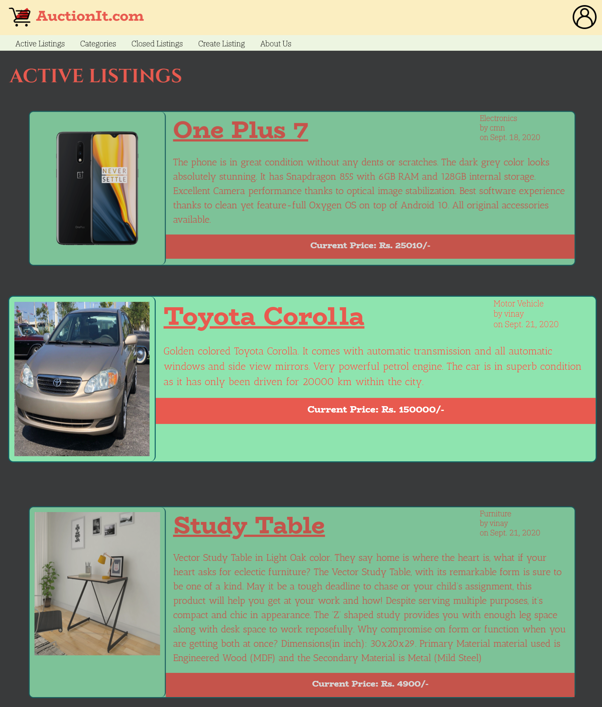  

   

## Registration Page: (/register)
---
The **Register Page** helps a new user to create a new account so that he can avail all the features of the website such as commenting, bidding and adding listings to a watchlist.

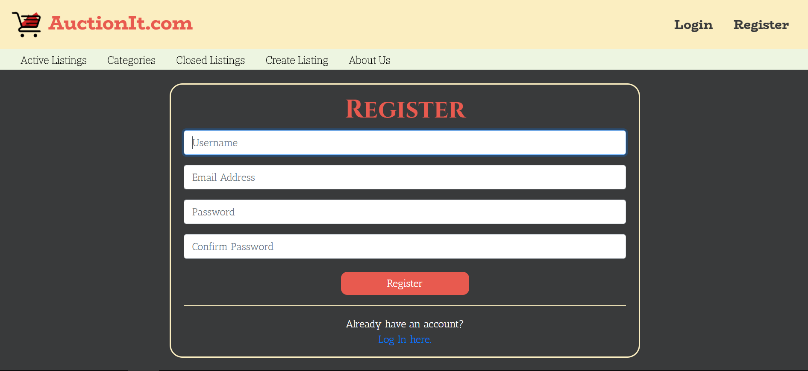  

 

## Login Page: (/login)
---
The **Login Page** helps the user to login in so that he can avail login specific features such as commenting on listings, bidding on listings and adding listings to watchlists. If the user does not have a account, he can create one using the register option.  

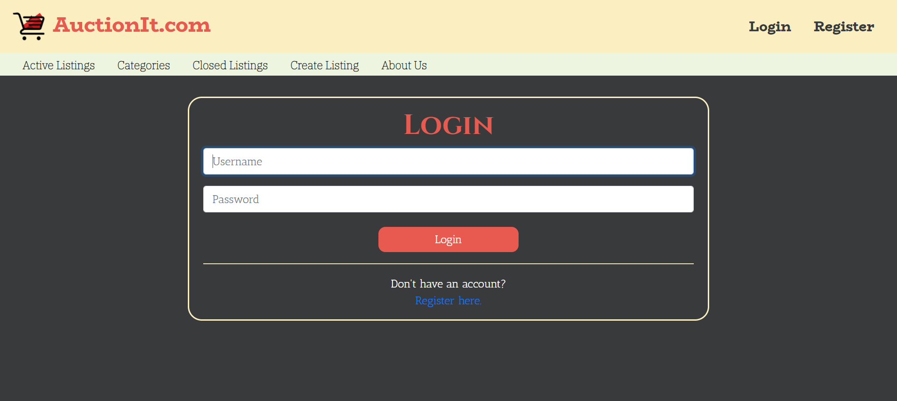  

   

## Logout: (/logout)
---
The **Logout** option is only available to a logged in user. A user can logout by clicking on the user icon on the top right of any page and then clicking on the _"LOGOUT"_ option.

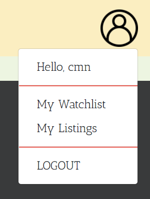  

   

## Create Listing: (/create)
---
The **Create Listing** option is only available to a logged in user. A user can create a new listing by click on the _"Create Listing"_ in the secondary navigation bar.  

The create listing page prompts the user to enter details such as title, description, starting price, image URL(optional) and category of the new listing. On clicking on _"Post Item"_, the listing gets saved in the database and the user is redirected to the newly created listing page.

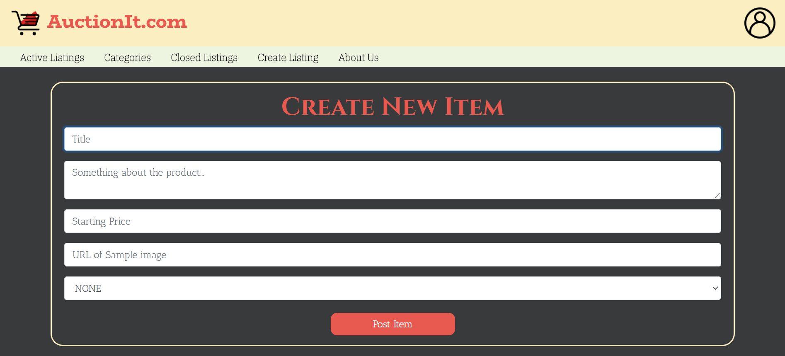  

   

## Listing Page: (/listing/\<listing_id\>)
---
The **Listing Page** can be reached on clicking a particular listing. The listing page shows detailed information of a particular listing. Information such as the current highest bidder, comments on the listing etc are present on this page.

###### No User:
If no logged in user is present, then the following page is displayed wherein there is prompt to login so that the user can interact with the item:

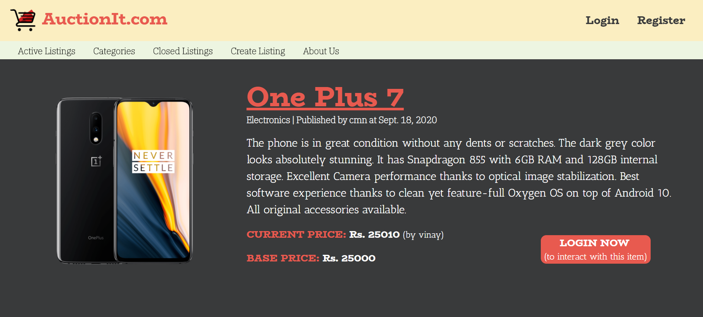  

###### Logged User:
If a user is logged in, the user can interact with the listing in various ways. The user can add the listing to his watchlist so that he can quickly access the listing for later reference. The user can make bids on the listings which is the main purpose of this web application, provided that the user isn't the owner of the listing. If a user is the owner of a listing, he/she is provided with the option of closing the auction. Also a logged in users can make comments on a listing.  

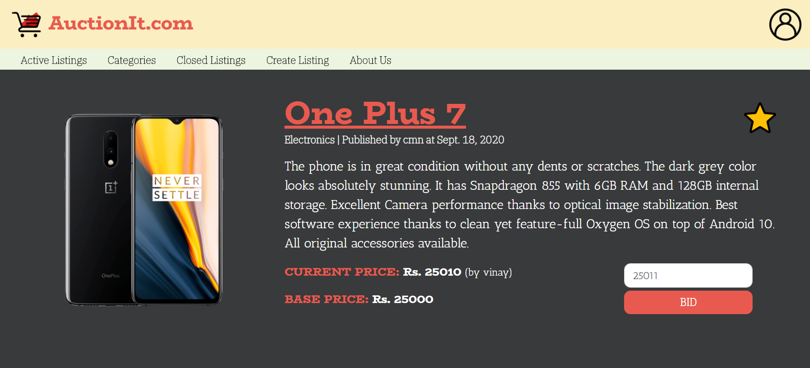

   

## Bids
---
**Bidding** is the primary use case of this web application. All bids are saved in the database using the _"Bid"_ models that we have created.  
The first bid on any listing can be equal to or greater than the _"Base Price"_ of the listing. For any further bids, the bid amount must be greater than the _"Current Price"_ i.e the preivious bid.

## Comments
---
**Comments** about of listing is visible on the _"Listing Page"_ of a listing below the information.

###### No User:
If no logged in user is present, then the user cannot make any comment on the listing though he can still see the comments made by other user. It looks as follows:

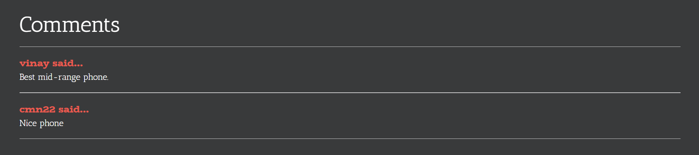  

###### Logged User:
If a user is logged in, the user can make comments along with being able to view other comments. It looks as follows:

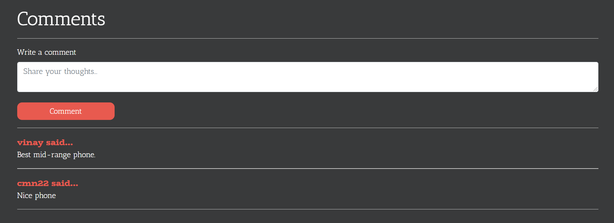

 

## Watchlist Page: (/watchlist)
---
The **Watchlist Page** is only available to users who are logged into their account. It can be accessed by clicking on the user icon and then clicking on _"My Watchlist"_. A page with all the watched listings is presented as in Active Listings Page.  

To add or remove a listing from the watchlist, the user can click on **Star** present besides the title of the listing on the listing page. If the page shows a _"Yellow Star"_, then the listing is already in the watchlist of the user. On clicking on this _"Yellow Star"_, the star turns into a transparent _"Black Bordered Star"_ which represents that the listing is not in the watchlist.

 

## My Listings Page: (/mylistings)
---
The **My Listing Page** is only available to users who are logged into their account. It can be accessed by clicking on the user icon and then clicking on _"My Listings"_. A page with all the listings that have been posted by the user is presented just like in the Active Listings Page.  

 

## Closed Listings Page: (/closedlistings)
---
The **Closed Listings Page** displays all those listings who have been closed i.e listings which are _"Inactive"_.

 

## Closed Listing: (/listing/\<listing_id\>)
---
The **Listing Page** of a closed listing is displayed differently depending if the user is the owner, winner or some other user.

###### Owner:
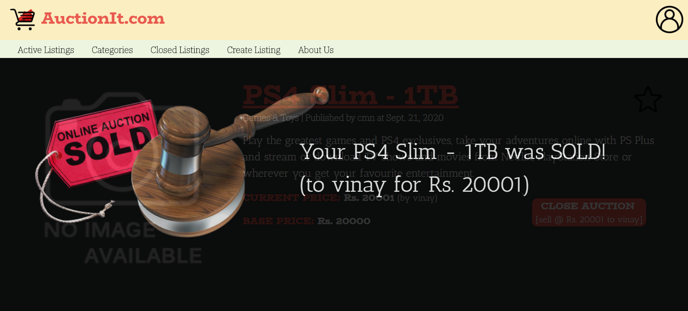  

###### Winner:
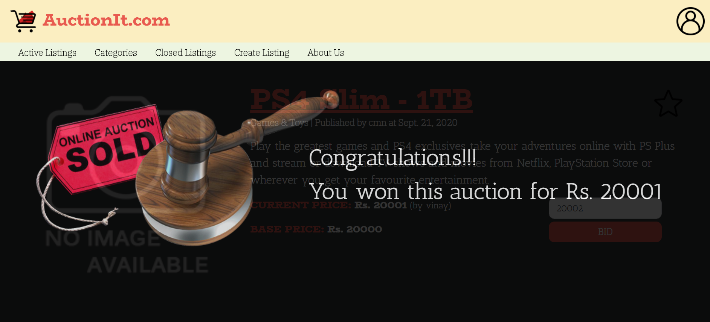  

###### Other Users:
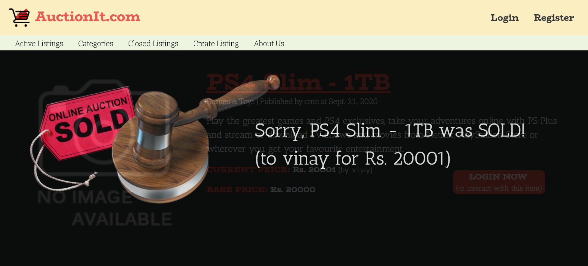

   

## Category: (/category/\<category_name\>)
---
The **Category Page** displays all possible listings present for a particular category. Listings of particular category can be accessed by clicking on the _"CATEGORIES"_ option in the secondary navigation bar and then clicking on a particular _"\<category_name\>"_ option to get results for a particular category. All listings are categorized into Fashion, Furniture, Electronics, Collectibles, Games & Toys, Motor Vehicle, Property or as None.  

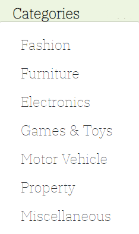  

 

## About Us Page: (/about)
---
The **About Us Page** displays basic information about the web application as well as the developer.  

In short, this website is about a online auction bidding site, wherein users can publish listings of the items they want to sell.

For demonstration and usage of this website, kindly watch this [YouTube](https://youtu.be/RZUgXt75px0) video.

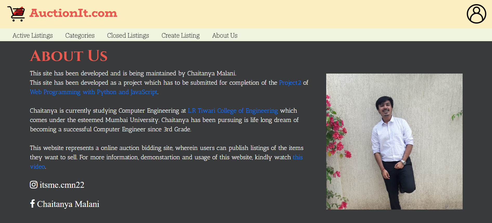  

 

## Author 
---
This project has been made by me, Chaitanya Malani and was completed on 22nd September 2020 for submission for [Project 2: Commerce](https://cs50.harvard.edu/web/2020/projects/2/commerce/) of the edX Course: [CS50's Web Programming with Python and JavaScript](https://www.edx.org/course/cs50s-web-programming-with-python-and-javascript).

I am an aspiring software engineer who is currently studying Computer Science in Mumbai, India. I love to code and explore various fields within computers. Also I am a very big football enthusiast and I love supporting Manchester United F.C.

Follow me on  
Instagram: https://www.instagram.com/itsme.cmn22/  
Twitter: https://twitter.com/ChaitanyaMalani
